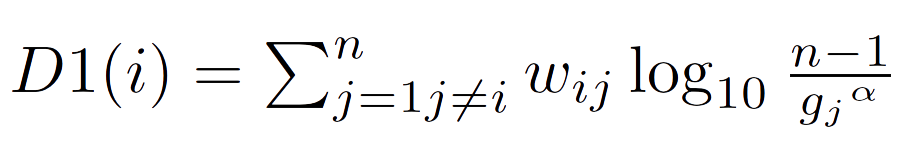

# Distinctiveness Docs

**Distinctiveness** is a Python package to calculate *Distinctiveness Centrality* in social and complex networks.

Distinctiveness Centrality is a set of 5 network metrics that attribute larger importance to distinctive connections, i.e. to nodes which have links to loosely connected peers. Revisiting degree and weighted degree centrality, all these metrics penalize connections to hubs or nodes that are very well connected. Distinctiveness measures might serve the identification of strategic social actors, for example those with peripheral connections that keep the network together, avoiding fragmentation. 

See the [functions page](functions.md) for more information.

### Installation
Install by running:

    pip install -U distinctiveness

### Functions
Functions are documented below, on this page.

### Tutorial and Source Code
Tutorials and the source code are available in the [GitHub repository](https://github.com/iandreafc/distinctiveness).

### Please cite as

Fronzetti Colladon, A., & Naldi, M. (2020). Distinctiveness Centrality in Social Networks. *PLoS ONE*, *15*(5), e0233276. [https://doi.org/10.1371/journal.pone.0233276](https://doi.org/10.1371/journal.pone.0233276)

### License

This project is licensed under the MIT license.

------

# Distinctiveness Centrality Functions

**Distinctiveness Centrality** is a set of 5 network metrics that attribute larger importance to distinctive connections, i.e. to nodes which have links to loosely connected peers. Revisiting degree and weighted degree centrality, all these metrics penalize connections to hubs or nodes that are very well connected. Distinctiveness measures might serve the identification of strategic social actors, for example those with peripheral connections that keep the network together, avoiding fragmentation.

The formula of **D1** is commented here, whereas complete descriptions can be found in the references.

Here *n* is the total number of nodes and gj the degree of node *j*. An exponent *alpha* >= 1 is used in the formulas to allow a stronger penalization of connections with highly connected nodes. The metric is similar to weighted degree centrality, as it sums the weight of all arcs connected to a node. However, weights are penalized based on the number of connections that a node’s peers have. If a neighboring node is connected to all the other nodes as well, its contribution to the sum is zero (with *alpha* = 1); the rationale is that node for which D1 is calculated (*i*) adds the minimum possible improvement to the reachability of its very well connected peer (*j*), since *j* is already connected to all other nodes. Instead, if a neighboring node is connected to node *i* only, the weight of the arc connecting them is multiplied by the maximum possible factor *log10(n-1)* (the rationale here is that node *j* would be unreachable if it were not connected by node *i*).

Similarly to the case of in- and out-degree, it is possible to calculate in- and out-distinctiveness on directed graphs. In directed networks, distinctiveness values incoming arcs more, if they originate at nodes with low out-degree. Indeed, a connection from a node sending arcs towards all other nodes is considered of little value. This can be explained through an example of love-letter writing. Consider the case where student A receives a love-letter from student B, who is sending love-letters to all people in the school. The letter sent to A is much less important to A than the case of B sending only one letter (to A). Indeed, B is ‘spamming’ all the network, sending many outgoing arcs, then each of them gives a low contribution to the receiver’s importance. Similarly, distinctiveness values outgoing arcs more when they reach peers with low in-degree. If the arc sent by a node is the only one, or among the few, to reach another node, that arc will be important. Continuing with the example, if student A receives a love letter from student B only, this is much more important than the case of A receiving many love letters.

## Function and Parameters

**`distinctiveness(G, alpha = 1, normalize = False, measures=["D1", "D2", "D3", "D4", "D5"])`**  : calculates distinctiveness centrality for directed and undirected graphs.

* **G** : `Graph`
  A [Networkx](https://networkx.github.io) Graph or DiGraph. Multigraphs are automaticallyt ransformed into graphs, by summing arc weights. Please note that each arc is expected to have a weight attribute, otherwise each missing weight will be considered equal to 1. Weights have to be >= 1.
* **alpha** : `float` or `list`, optional (default=1)
  Alpha must be a number greater or equal to 1. It represents the value of the alpha parameter used in the formulas of distinctiveness centrality. If one value is provided, it will be used for all the five metrics. Alternatively, alpha can be a list of five numbers, used to specify different coefficients for the different metrics (e.g. alpha = [1, 2, 1, 1, 3]).
* **normalize** : `bool`, optional (default=False)
  Normalize can be set to True, to obtain normalized scores for each metric, considering upper and lower bounds. Loose upper
  and lower bounds are used for D3.
* **measures** : `list`, optional (default=["D1", "D2", "D3", "D4", "D5"])
  Distinctiveness centrality can be calculated considering 5 different weighting schemes. This parameter can be adjusted to select which metrics should be computed. The default option is to calculate them all.

#### Returns

* **nodes** : `dictionary`
  A dictionary with a key for all selected measures. Since distinctiveness can be calculated using five different formulas, the 5 keys for undirected networks are named as D1, D2, D3, D4 and D5. These measures can be calculated if a Graph is given as input. The other 10 measures are for directed networks and will be available if a DiGraph is given as input. These are: D1_in, D2_in, D3_in, D4_in, D5_in, D1_out, D2_out, D3_out, D4_out and D5_out.

##### Two more functions are provided to calculate distinctiveness based on node and edge attributes.

**`dc_nodeattribute(G, attname, alpha = 1, measures=["D1", "D2", "D3", "D4", "D5"])`**  : calculates distinctiveness centrality for directed and undirected graphs, separating the contribution of each node, based on a specific attribute (such as *gender*). 

* **G** : `Graph`
  A [Networkx](https://networkx.github.io) Graph or DiGraph. Multigraphs are automaticallyt ransformed into graphs, by summing arc weights. Please note that each arc is expected to have a weight attribute, otherwise each missing weight will be considered equal to 1. Weights have to be >= 1.

* **attname**: `string`
  Indicates the name of the node attribute to consider for the calculation of distinctiveness. The function automatically extracts all the possible values for that attribute.

* **alpha** : `float` or `list`, optional (default=1)
  Alpha must be a number greater or equal to 1. It represents the value of the alpha parameter used in the formulas of distinctiveness centrality. If one value is provided, it will be used for all the five metrics. Alternatively, alpha can be a list of five numbers, used to specify different coefficients for the different metrics (e.g. alpha = [1, 2, 1, 1, 3]).

* **measures** : `list`, optional (default=["D1", "D2", "D3", "D4", "D5"])
  Distinctiveness centrality can be calculated considering 5 different weighting schemes. This parameter can be adjusted to select which metrics should be computed. The default option is to calculate them all.

#### Returns

* **DC** : `Pandas DataFrame`
  A Pandas DataFrame containing the distinctiveness centrality metrics for all the selected measures, with separate scores for each possible attribute value.

**`dc_edgeattribute(G, attname, alpha = 1, measures=["D1", "D2", "D3", "D4", "D5"])`** : calculates distinctiveness centrality for directed and undirected graphs, based on a specific attribute of edges (such as distinguishing between friendship and family ties). 

* **G** : `Graph`
  A [Networkx](https://networkx.github.io) Graph or DiGraph. Multigraphs are automaticallyt ransformed into graphs, by summing arc weights. Please note that each arc is expected to have a weight attribute, otherwise each missing weight will be considered equal to 1. Weights have to be >= 1.

* **attname**: `string`
  Indicates the name of the edge attribute to consider for the calculation of distinctiveness. The function automatically extracts all the possible values for that attribute.

* **alpha** : `float` or `list`, optional (default=1)
  Alpha must be a number greater or equal to 1. It represents the value of the alpha parameter used in the formulas of distinctiveness centrality. If one value is provided, it will be used for all the five metrics. Alternatively, alpha can be a list of five numbers, used to specify different coefficients for the different metrics (e.g. alpha = [1, 2, 1, 1, 3]).

* **measures** : `list`, optional (default=["D1", "D2", "D3", "D4", "D5"])
  Distinctiveness centrality can be calculated considering 5 different weighting schemes. This parameter can be adjusted to select which metrics should be computed. The default option is to calculate them all.

#### Returns

* **DC** : `Pandas DataFrame`
  A Pandas DataFrame containing the distinctiveness centrality metrics for all the selected measures, with separate scores for each possible attribute value.
